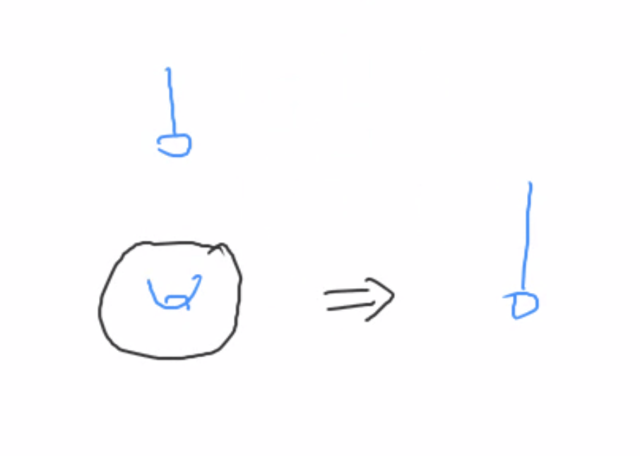
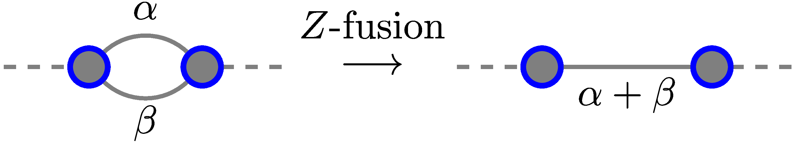
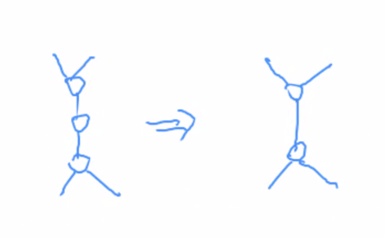
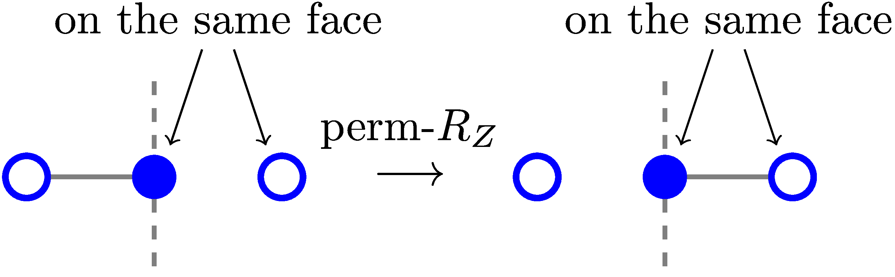
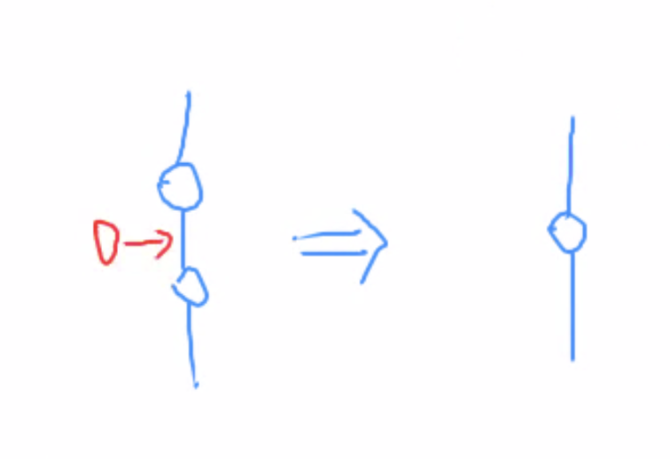
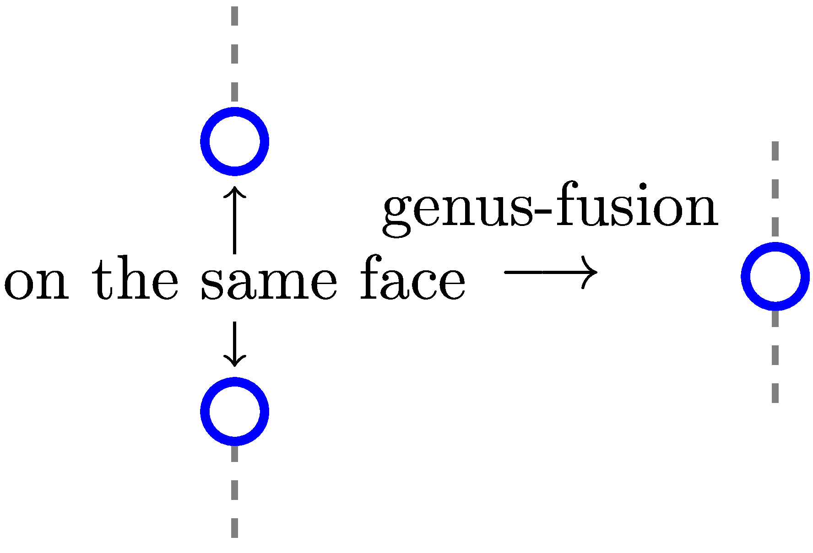
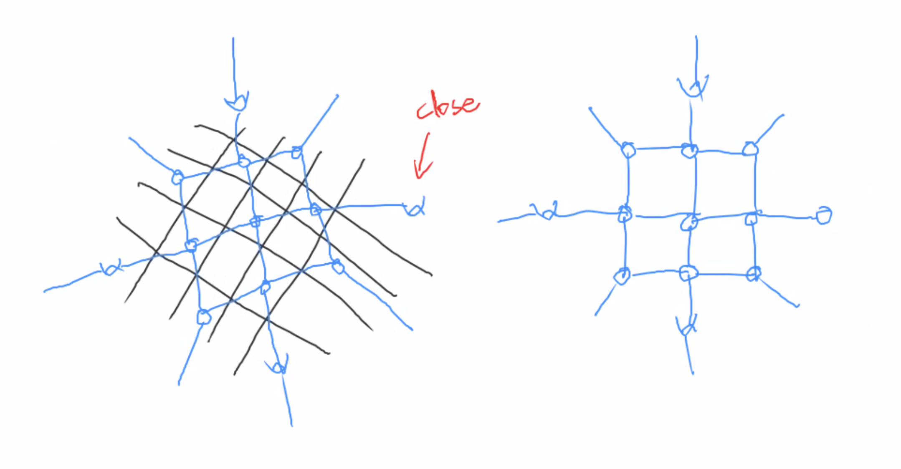

```@meta
CurrentModule = Quon
```

# Quon

## Rules

### String Genus



### Yang Baxter (Star/Triangle)


### Z Fusion



### X Fusion



### Perm Rz



We only consider the pattern on the LHS for now.

### Identity



The phase of an edge is approximately zero.

### Genus Fusion



### Swap Genus



This rule is from the 3D diagram, we force removing one of the genus of a swap operator since they are the same operator
in the 3D diagram. Might should revisit the 3D diagram skeleton graph idea later.

```@index
```

```@autodocs
Modules = [Quon]
```
